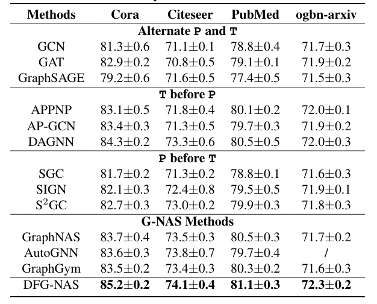
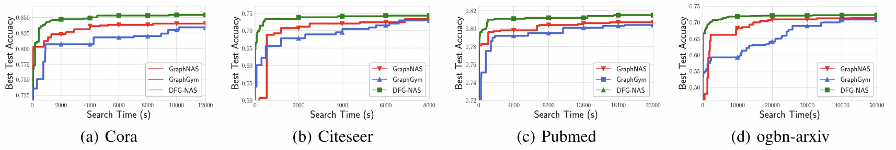
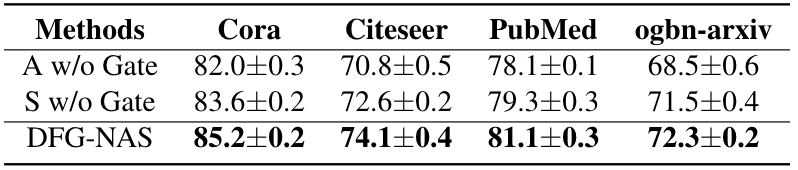
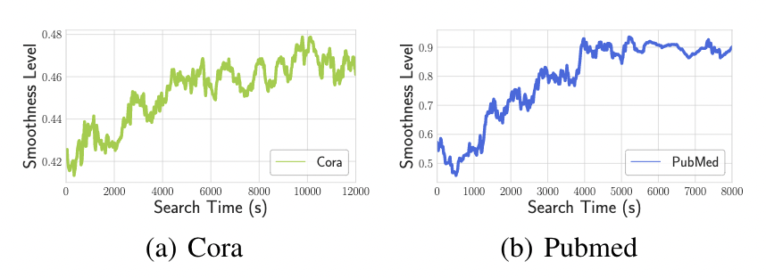
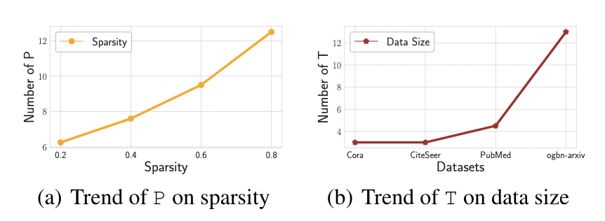

# DFG-NAS: Deep and Flexible Graph Neural Architecture Search.

This repository is the official implementation of DFG-NAS. 

## Requirements

To install requirements:

```setup
pip install -r requirements.txt
```


## Training

To search the neural architectures in the paper:

> cd the  “code” folde

> run the python file search-cora.py to show the results on Cora datasets.

> run the python file search-citeseer.py to show the results on Citeseer datasets.

> run the python file search-pubmed.py to show the results on PubMed datasets.

> run the python file search-ogbn.py to show the results on ogbn-arxiv datasets.


## Results

1. Accuracy comparison:



2. Search time comparison:



3. Gate operation comparison:



4. Avarage smoothness analysis:



5. Interpretability:

